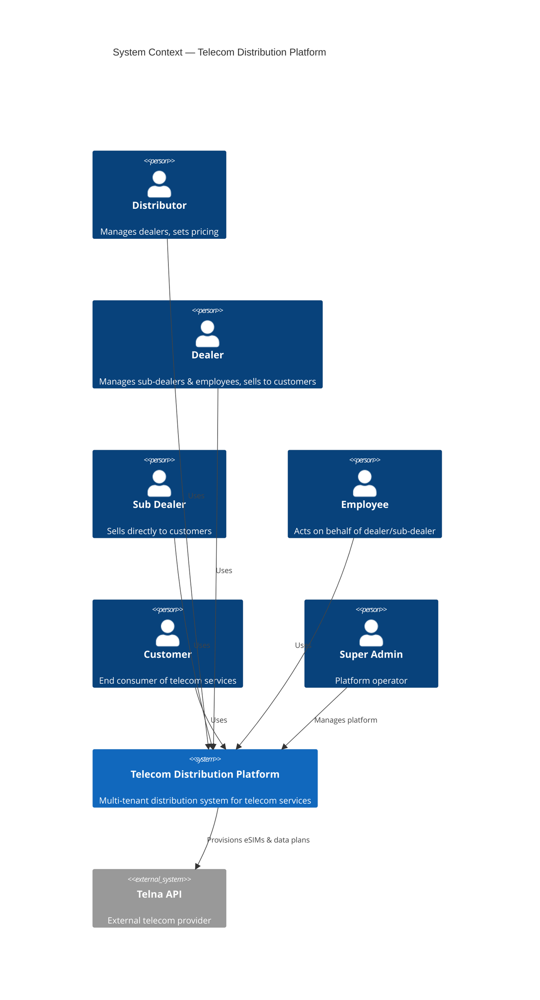
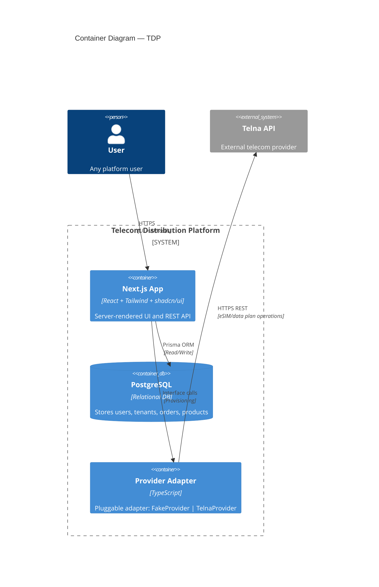
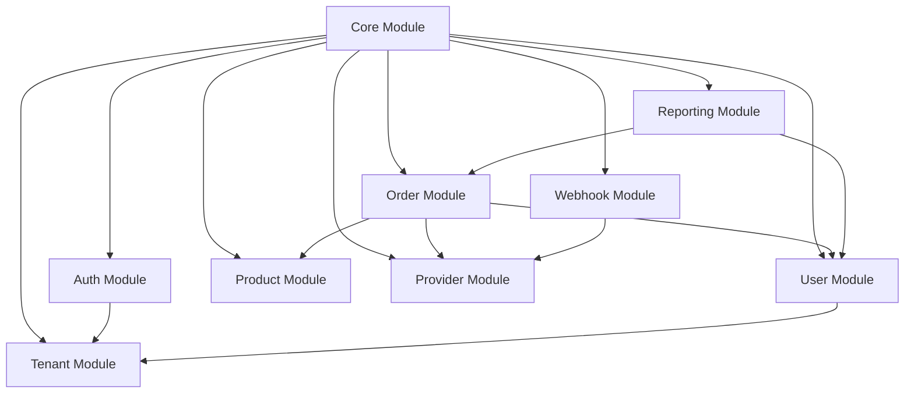

# Telecom Distribution Platform (TDP) — Software Architecture Document

## 1. Overview

The Telecom Distribution Platform (TDP) is a multi-tenant, multi-tier distribution system for telecom services (eSIM, data plans, voice bundles). It enables a hierarchical distribution chain from Distributors down to End Customers, with each tier having distinct roles, permissions, and ordering capabilities.

### 1.1 Business Flow

```
Telna (API Provider)
       |
Distributor (Top-level tenant)
       |
   Dealer
       |
  Sub Dealer
       |
   Employee
       |
   Customer
```

- **Distributor**: Onboards Dealers, sets pricing, views aggregate reports.
- **Dealer**: Onboards Sub Dealers and Employees, manages customers, places orders.
- **Sub Dealer**: Sells directly to Customers or employs staff.
- **Employee**: Acts on behalf of a Dealer/Sub Dealer with limited scope.
- **Customer**: End user who consumes the telecom service.

### 1.2 Architecture Style

- **Frontend**: Next.js 14+ (App Router), React, Tailwind CSS, shadcn/ui
- **Backend**: Next.js API Routes (REST), service layer pattern
- **Database**: PostgreSQL via Prisma ORM
- **Provider Integration**: Pluggable adapter pattern (FakeProvider for dev/test, TelnaProvider for production)
- **Auth**: NextAuth.js / Auth.js with role-based access control (RBAC)

---

## 2. System Context Diagram



---

## 3. Container Diagram



---

## 4. Layer Architecture

```
┌─────────────────────────────────────────────┐
│              Presentation Layer              │
│  Next.js Pages / Components (React Server)   │
│  shadcn/ui + Tailwind                        │
├─────────────────────────────────────────────┤
│               API Layer (REST)               │
│  Next.js Route Handlers                      │
│  Input validation (Zod)                      │
├─────────────────────────────────────────────┤
│              Service Layer                   │
│  Business logic, orchestration, RBAC checks  │
├─────────────────────────────────────────────┤
│             Repository Layer                 │
│  Prisma queries, data access patterns        │
├─────────────────────────────────────────────┤
│           Provider Adapter Layer             │
│  IProvider interface                         │
│  FakeProvider (dev/test)                     │
│  TelnaProvider (production)                  │
└─────────────────────────────────────────────┘
```

### 4.1 Dependency Rule

Each layer depends only on the layer directly below it. The Provider Adapter is injected via dependency inversion — the service layer depends on the `IProvider` interface, not on concrete implementations.

---

## 5. Module Map & Dependency Graph



### 5.1 Module Descriptions

| Module | Responsibility |
|---|---|
| **Core** | Shared types, enums, constants, base classes, utility functions |
| **Auth** | Authentication, session management, RBAC guards |
| **Tenant** | Multi-tenant hierarchy management (Distributor → Dealer → Sub Dealer) |
| **User** | User CRUD, profile, employee management |
| **Product** | Product catalog, pricing tiers, country/region mapping |
| **Order** | Order lifecycle, payment tracking, fulfillment |
| **Provider** | Provider interface, FakeProvider, TelnaProvider adapters |
| **Webhook** | Incoming webhook handling from Telna (status updates, usage alerts) |
| **Reporting** | Aggregated reports, dashboards, export |

---

## 6. Technology Stack

| Layer | Technology |
|---|---|
| Framework | Next.js 14+ (App Router) |
| Language | TypeScript (strict mode) |
| Styling | Tailwind CSS + shadcn/ui |
| Database | PostgreSQL 15+ |
| ORM | Prisma |
| Auth | Auth.js (NextAuth.js v5) |
| Validation | Zod |
| Testing | Vitest + Playwright |
| Package Manager | pnpm |
| Containerization | Docker + Docker Compose |

---

## 7. Security & Multi-Tenancy

- **Tenant Isolation**: All tables include `tenant_id` and `distributor_id` columns. Every query filters by the user's tenant scope.
- **RBAC**: Role-based access control with hierarchical permissions. A Distributor cannot view another Distributor's data.
- **Row-Level Security (RLS)**: Optional PostgreSQL RLS policies as a defense-in-depth layer.
- **API Security**: All API routes validate authentication via middleware. CORS restricted to known origins.

---

## 8. Deployment (Target)

```
Docker Compose:
  - app: Next.js standalone build
  - db: PostgreSQL 15
  - redis: (optional) for session caching & rate limiting
```

---

## 9. Development Workflow

1. **FakeProvider** is the default adapter — all development and tests run against it.
2. **TelnaProvider** is activated via environment variable `TELNA_API_KEY` in production.
3. Feature toggles allow switching providers per tenant for staging/testing.
