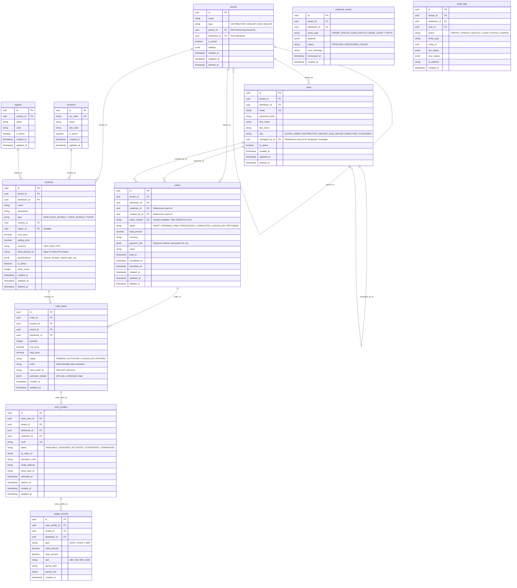

# Database Schema — ER Diagram

## 1. Naming Conventions

- **Tables**: `snake_case`, pluralized (e.g., `users`, `order_items`)
- **Columns**: `snake_case`
- **Primary Keys**: `id` (UUID v4)
- **Foreign Keys**: `{reference_table}_id` (e.g., `tenant_id`, `distributor_id`)
- **Timestamps**: `created_at`, `updated_at`, `deleted_at` (soft delete)
- All tables include `tenant_id` and `distributor_id` for multi-tenant isolation.

---

## 2. Entity Relationship Diagram



---

## 3. Key Table Details

### 3.1 `tenants`
Hierarchical tenant structure. `type` determines the tier. `parent_id` creates the tree:
- `DISTRIBUTOR` → `parent_id` is NULL
- `DEALER` → `parent_id` references a DISTRIBUTOR
- `SUB_DEALER` → `parent_id` references a DEALER

`distributor_id` is always the root DISTRIBUTOR for the branch, propagated down.

### 3.2 `users`
Unified user table with `role` discriminator. `managed_by_id` links an Employee to their manager (a Dealer or Sub Dealer user). Customers are linked to the tenant that owns them.

### 3.3 `products`
Products are tenant-scoped. A Distributor defines products and their pricing. Dealers/Sub Dealers may have visibility limited to specific product sets. `telna_product_id` maps to the external provider's catalog.

### 3.4 `orders`
Order lifecycle tracked via `status` field. Each order belongs to a tenant and is created by a user on behalf of a customer.

### 3.5 `esim_profiles`
Tracks the lifecycle of each eSIM from availability through activation to termination. QR code and activation data stored for customer delivery.

### 3.6 `audit_logs`
Immutable log for compliance and debugging. Captures all state-changing operations.

---

## 4. Index Strategy

```sql
-- Core lookup indexes
CREATE INDEX idx_users_tenant ON users(tenant_id);
CREATE INDEX idx_users_email ON users(email) WHERE deleted_at IS NULL;
CREATE INDEX idx_orders_tenant ON orders(tenant_id);
CREATE INDEX idx_orders_status ON orders(status);
CREATE INDEX idx_orders_customer ON orders(customer_id);
CREATE INDEX idx_order_items_order ON order_items(order_id);
CREATE INDEX idx_esim_iccid ON esim_profiles(iccid);
CREATE INDEX idx_esim_status ON esim_profiles(status);
CREATE INDEX idx_products_tenant ON products(tenant_id);
CREATE INDEX idx_products_telna ON products(telna_product_id);
CREATE INDEX idx_usage_esim ON usage_records(esim_profile_id);
CREATE INDEX idx_audit_entity ON audit_logs(entity_type, entity_id);
CREATE INDEX idx_webhook_status ON webhook_events(status);
```

---

## 5. Multi-Tenant Query Pattern

Every repository query MUST include tenant filtering:

```typescript
// Example Prisma query with tenant isolation
const orders = await prisma.order.findMany({
  where: {
    tenant_id: user.tenant_id,
    // distributor_id: user.distributor_id, // for cross-tenant admin views
  },
  include: { order_items: true },
});
```
